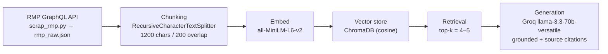

# Project 1 Planning: The Unofficial Guide

> Write this document before you write any pipeline code.
> Your spec and architecture diagram are what you'll use to direct AI tools (Claude, Copilot, etc.) to generate your implementation — the more specific they are, the more useful the generated code will be.
> Update the Retrieval Approach and Chunking Strategy sections if you change your approach during implementation.
> Update this file before starting any stretch features.

---

## Domain

**Domain: UCLA professor and course reviews.**

My system makes searchable the experiential knowledge UCLA students share about *who* to take a class with and *what that class is actually like* — teaching style, exam fairness, grading harshness, workload, and whether the professor is worth it. The official course catalog lists a title and a description; it never tells you that one Chem 20A professor's exams come "out of left field" relative to the readings, or that a particular math professor's midterm proofs are "not in the same atmosphere" as what was covered in lecture. That signal only exists in thousands of scattered, one-off student reviews. It's hard to find through official channels because the university has no incentive to publish it, and hard to use even on Rate My Professors because the opinions are unstructured, contradictory, and buried across hundreds of individual professor pages with no way to ask a question across all of them at once.

---

## Documents

<!-- One "document" in this corpus = one individual student review, combining the professor's
     aggregate stats (rating, difficulty, would-take-again) with the student's free-text comment.
     Source: the Rate My Professors GraphQL API, collected by scrap_rmp.py. -->

**Source:** Rate My Professors (`ratemyprofessors.com`), collected via its public GraphQL endpoint by `scrap_rmp.py`. The legacy `RateMyProfessorAPI` PyPI package returns HTTP 403, so the scraper queries the GraphQL API directly with a browser `User-Agent` and RMP's public `test:test` token.

**Scope:** UCLA (school ID 1075), the 60 most-reviewed professors with ≥5 ratings, up to 10 individual reviews each → **596 review-documents across 26 departments**, dates ranging 2005–2026.

Each review-document is a short text blob: a metadata header (professor, department, overall rating /5, difficulty /5, would-take-again %, course, grade) followed by `Student review: <comment>`. Mean length ≈ 392 characters (range 159–554).

| # | Source / slice of the corpus | Description | URL or location |
|---|------------------------------|-------------|-----------------|
| 1 | RMP — Mathematics (e.g. Sihao Ma, Lincoln Chayes) | 70 reviews; polarizing, high-difficulty profs | `documents/rmp_raw.json` |
| 2 | RMP — English | 60 reviews; writing-heavy course feedback | `documents/rmp_raw.json` |
| 3 | RMP — Chemistry (e.g. Delroy A. Baugh) | 59 reviews; weed-out course sentiment | `documents/rmp_raw.json` |
| 4 | RMP — History | 49 reviews; lecture/reading-load opinions | `documents/rmp_raw.json` |
| 5 | RMP — Anthropology | 49 reviews; seminar-style feedback | `documents/rmp_raw.json` |
| 6 | RMP — Psychology | 40 reviews; large-lecture experiences | `documents/rmp_raw.json` |
| 7 | RMP — Physics | 20 reviews; problem-set / exam difficulty | `documents/rmp_raw.json` |
| 8 | RMP — Computer Science (e.g. Jordan Mendler) | 20 reviews; teaching style + helpfulness | `documents/rmp_raw.json` |
| 9 | RMP — Accounting / Communication / Sociology / Life Science | 20 each; breadth across non-STEM and STEM | `documents/rmp_raw.json` |
| 10 | RMP — Economics, Physics, Mech. Eng., Dental, Humanities, +others | remaining ~14 departments for coverage | `documents/rmp_raw.json` |

> All 596 reviews are persisted to `documents/rmp_raw.json`. Re-collect with `python scrap_rmp.py`.

---

## Chunking Strategy

<!-- Reflects the actual configuration in ingest.py. -->

**Strategy (of the three taught — fixed-size, semantic, recursive): Recursive.** Not fixed-size (which would cut blindly every N chars) and not semantic (which would embed and group by meaning); recursive splitting respects natural boundaries with a separator hierarchy and is the right fit for these short, paragraph-shaped reviews.

**Chunk size:** 1200 characters (≈ 300 tokens at ~4 chars/token)

**Overlap:** 200 characters

**Splitter:** `RecursiveCharacterTextSplitter` (langchain-text-splitters) with separators `["\n\n", "\n", ". ", " ", ""]`, so it prefers to break on paragraph → line → sentence → word boundaries rather than mid-word. Because each review (mean ≈ 392 chars) is shorter than the 1200-char window, this almost never splits — it effectively yields **one review per chunk**.

**Reasoning:**
- These documents are **short, self-contained reviews** (mean ≈ 392 chars, max 554), not long-form guides. A 1200-char window comfortably holds an entire review — header stats *and* the student comment — in a single chunk. That's deliberate: for opinion text, the unit of meaning is the whole review, and the professor's name/rating in the header is the context that makes the comment retrievable and attributable. Splitting a review smaller would orphan a sentence like "his tests are unrelated to the readings" from the professor it's about.
- Because each review fits in one chunk, the **596 documents produce ~596 chunks** — roughly one chunk per review. The 200-char overlap almost never triggers here (reviews rarely exceed 1200 chars), but it's retained so the same config still behaves well if a longer review or a future long-form source (a syllabus, an FAQ) is added to the corpus.
- **Too small (e.g. 200 chars):** a fragment like "his tests were completely from out of" carries no standalone meaning and no professor attribution — retrieval would surface noise. **Too large (e.g. merging many reviews):** a single chunk covering five different professors dilutes the embedding so no specific query matches it cleanly. One-review-per-chunk sits in the right spot for this corpus.

---

## Retrieval Approach

**Embedding model:** `all-MiniLM-L6-v2` via `sentence-transformers` (384-dim, runs locally, no API key, no rate limits). Stored in **ChromaDB** (`PersistentClient` → `chroma_db/`, collection `unofficial_guide`) with `hnsw:space = "cosine"`.

**Top-k:** Start at **k = 4–5** for generation. (The smoke test in `ingest.py` uses k = 3.) Too few and the relevant review may not be in the set at all — especially for polarized professors where the one balanced review matters; too many and contradictory reviews of *different* professors dilute the context and pull the answer off-target.

**Why semantic search here:** student reviews rarely repeat the query's exact words ("useful feedback" vs. "he actually explains how to fix your essay"), so keyword match would miss them; embedding similarity captures the meaning.

**Production tradeoff reflection:** If cost weren't a constraint, I'd weigh a larger hosted model (e.g. OpenAI `text-embedding-3-large` or Voyage's domain models) against MiniLM:
- **Accuracy on domain text** — slang, professor nicknames, and course codes ("Chem 20A", "weed-out") are where MiniLM is weakest; a larger model embeds these more faithfully.
- **Context length** — irrelevant for short reviews, but matters if I add long syllabi/FAQs later.
- **Multilingual** — not needed for an English-only UCLA corpus, so I wouldn't pay for it.
- **Latency & local vs. API** — MiniLM's local, zero-cost, no-rate-limit inference is a real advantage for a student project and for privacy; a hosted model adds per-call latency and a key to manage. For this scale, MiniLM's quality is good enough that the local tradeoff wins.

---

## Evaluation Plan

<!-- 5 specific, verifiable questions. Expected answers are grounded in actual review text in
     documents/rmp_raw.json. Q1 is the designed-to-stress (likely failure) case; Q5 tests refusal. -->

| # | Question | Expected answer |
|---|----------|-----------------|
| 1 | What do students say about Professor Sihao Ma's exams in his math classes? | **Polarized.** Most reviews warn the exams are extremely difficult — midterm proof questions "not in the same atmosphere" as lecture, plus a harsh grading scheme; a minority defend him as clear if you understand the concepts. Aggregate: 1.7/5 rating, 4.7/5 difficulty. *(Stress test: top-k may surface only one side.)* |
| 2 | Why do students recommend avoiding Professor Delroy A. Baugh for general chemistry? | Lectures relate little to the textbook/homework, he teaches above the level of Chem 20A, and exam questions are "out of left field" / unrelated to the assigned readings. Aggregate: 1.5/5 rating, 4.1/5 difficulty. |
| 3 | Which Computer Science professor do students describe as caring and chill, and why? | **Jordan Mendler** — described as awesome, caring, and "super chill"; treats students like adults, is always willing to help, even throws an end-of-class ice-cream party. Aggregate: 5.0/5 rating. |
| 4 | Is Professor Stephen Ross's economics course considered easy or hard? | **Easy.** 4.8/5 rating, 1.3/5 difficulty, ~91% would take again; students call him engaging/passionate and the course "great to take." |
| 5 | Which UCLA dorm has the best dining hall? | **Out of scope** — the corpus contains only professor reviews, no housing/dining content. Correct behavior: the system should say it doesn't have enough information, *not* invent an answer. |

---

## Anticipated Challenges

1. **Retrieval sampling bias on polarized professors.** For someone like Sihao Ma whose reviews are genuinely contradictory, the top-k nearest chunks may all happen to be the angry ones (or all the defenders), so the LLM produces a confidently one-sided answer that misrepresents the consensus. This is a retrieval-stage risk, not a generation one — mitigations include a higher k or returning the aggregate rating alongside the comments.

2. **Un-decoded HTML entities in source text.** 16 of 596 reviews contain artifacts like `&quot;`, `&amp;`, and `&#39;` pulled straight from the RMP API (e.g. `Worst &quot;teacher&quot; I've ever had`). These survive into the embeddings and can show up verbatim in cited answers, and `&quot;`/`&amp;` may slightly perturb the embedding. The cleaning step should `html.unescape()` each comment before chunking.

3. **(Bonus) Aggregate vs. per-review confusion.** Each chunk repeats the professor's *overall* rating in its header, but the comment is one student's view. A question like "what's professor X's rating" is answerable from metadata, but "do students like X" requires reading multiple comments — the system must not treat one retrieved review as the whole picture.

---

## Architecture

```
┌─────────────────┐   ┌──────────────┐   ┌────────────────────┐   ┌──────────────┐   ┌────────────────┐
│ 1. INGESTION    │   │ 2. CHUNKING  │   │ 3. EMBED + STORE   │   │ 4. RETRIEVAL │   │ 5. GENERATION  │
│                 │──▶│              │──▶│                    │──▶│              │──▶│                │
│ RMP GraphQL API │   │ Recursive-   │   │ all-MiniLM-L6-v2   │   │ cosine top-k │   │ Groq           │
│ → rmp_raw.json  │   │ CharacterText│   │ (sentence-         │   │ (k = 4–5)    │   │ llama-3.3-70b  │
│ (scrap_rmp.py)  │   │ Splitter     │   │  transformers)     │   │ over Chroma  │   │ grounded +     │
│ 596 reviews     │   │ 1200 / 200   │   │ → ChromaDB         │   │              │   │ source cites   │
│                 │   │ ≈596 chunks  │   │ (chroma_db/)       │   │              │   │ (query.py)     │
└─────────────────┘   └──────────────┘   └────────────────────┘   └──────────────┘   └────────────────┘
        scrap_rmp.py  ───────────────  ingest.py  ───────────────▶          query.py / app.py ────────▶
```



---

## AI Tool Plan

**Milestone 3 — Ingestion and chunking (`scrap_rmp.py`, `ingest.py`):**
Tool: **Claude**. Input: the Documents + Chunking Strategy sections above and the architecture diagram. Ask it to implement (a) a scraper that hits the RMP GraphQL endpoint, filters to ≥5-rating professors, and writes `documents/rmp_raw.json`, and (b) an ingest script that loads that JSON, chunks each review with `RecursiveCharacterTextSplitter` at 1200/200, and attaches source metadata. **Verify:** confirm the live splitter values match this spec (1200/200), print 5 chunks to confirm each holds one complete review, and check the chunk count lands near 596.

**Milestone 4 — Embedding and retrieval (`ingest.py`):**
Tool: **Claude**. Input: the Retrieval Approach section + diagram. Ask it to embed chunks with `all-MiniLM-L6-v2`, upsert into a persistent ChromaDB collection with `hnsw:space="cosine"` and per-chunk metadata (professor, department, rating, course, source, chunk_index), and write a `retrieve(query, k)` function returning chunks + distances. **Verify:** run 3 eval questions and confirm distances < 0.5 and that returned chunks are about the right professor.

**Milestone 5 — Generation and interface (`query.py`, `app.py`):**
Tool: **Claude**. Input: the grounding requirement (answer *only* from retrieved chunks; refuse when context is insufficient), the desired output format (answer + source list), and the Gradio skeleton. Ask it to wire retrieval → a Groq `llama-3.3-70b-versatile` call with a strict system prompt, and append source attributions programmatically (not left to the model). **Verify:** run Q5 (out-of-scope) and confirm the system declines rather than inventing an answer, and that every answer lists its source professor/review.
